# ComfyUI-MieNodes  

[English](README.md) | [简体中文](README_CN.md)  

**ComfyUI-MieNodes** is a plugin for the ComfyUI ecosystem, offering a series of utility nodes designed to simplify workflows and enhance efficiency.  

---

## Workflows

Currently, the following services are supported:
  - [ZhiPu 智谱](https://www.bigmodel.cn/invite?icode=saVhjJ197Yj7qCQ24NRSpGczbXFgPRGIalpycrEwJ28%3D)
  - [SiliconFlow 硅基流动](https://cloud.siliconflow.cn/i/PYyJkS9S)
  - [GitHub Models](https://github.com/marketplace?type=models)
  - [Kimi](https://platform.moonshot.cn)
  - [DeepSeek](https://platform.deepseek.com)
  - [Gemini](https://ai.google.dev/gemini) - I supposed it works, but I could not test it now.

If you wish to use other large language model (LLM) services that cannot be connected through SetGeneralLLMServiceConnector, please submit an issue or a pull request for feedback.
 
Among them, Zhipu AI's GLM-4-Flash-250414 and SiliconFlow's Qwen3-8B, GLM-Z1-9B-0414, and GLN-4-9B-0414 are free models. You only need to register and obtain an API Key (or Token) to use them without restriction.

### Kontext Presets Prompt Generator Workflow

This workflow demonstrates how to load an image, generate a detailed description using the Florence2 model, and compose context prompts with the help of large language models. The results are displayed both in English and Chinese using the `Show Anything` node.  
- **Image Loader**: Loads the input image.
- **Florence2 Model Loader & Describe Image**: Generates a detailed caption for the image.
- **Set SiliconFlow LLM Service Connector & Kontext Prompt Generator**: Uses LLM to create context-aware prompts.
- **Show Anything**: Displays the generated result.

### Check LLM Service Connection Workflow
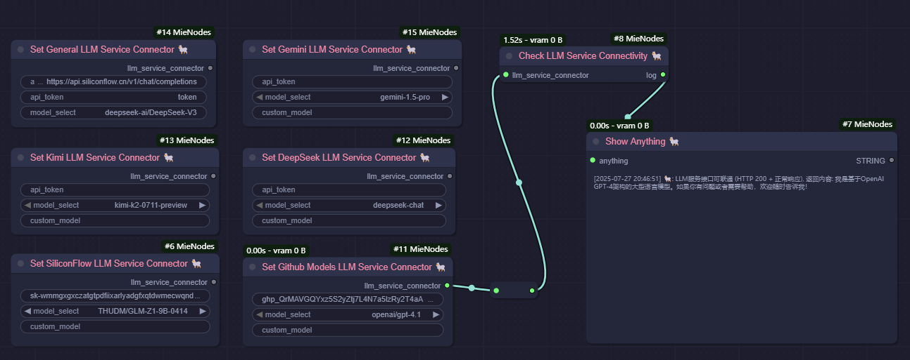

This workflow checks the connection to the LLM service and displays the result.

### Kontext Presets Add and Remove Workflow

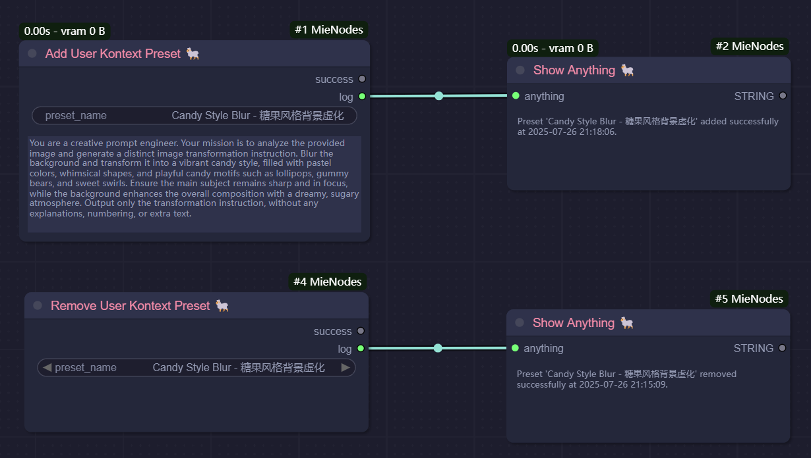

This workflow demonstrates how to add and remove a custom preset.

### Advanced Prompt Generator Workflow

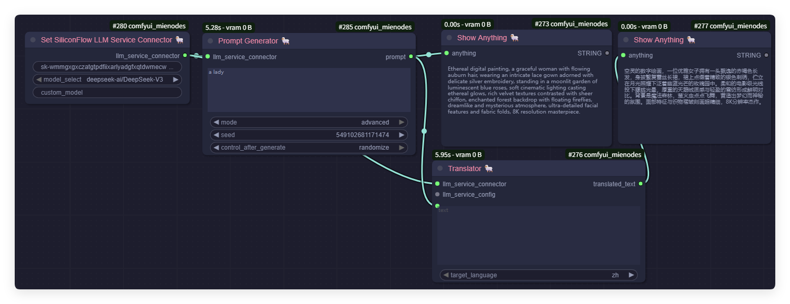

This workflow focuses on generating an artistic prompt for an ethereal digital portrait using the LLM connector and advanced prompt generator nodes.  
- **Prompt Generator**: Produces detailed prompts for creative tasks.
- **Show Anything**: Displays the generated result.

---

## Current Features  

### Prompt Enhancement Features

The plugin provides a suite of nodes for prompt enhancement, offering:

1. A collection of preset workflows that leverage large language models to automatically generate high-quality prompts from image and text inputs.
2. Advanced prompt optimization, including automatic translation and enrichment of details, enabling richer, more expressive outputs for various creative tasks.

---

### LoRA Training Caption Preparation Features  

The plugin provides the following utility nodes, with a focus on dataset file management tasks in LoRA training workflows:  

1. Batch edit caption files (Insert/Append/Replace operations).  
2. Batch rename files, add prefixes, and format file numbering for specific file types.  
3. Synchronize image and caption files, with support for automatically creating or removing `.txt` files to match image files.  
4. Batch read caption files, with support for extracting all file contents for analysis and summarization by large language models.  
5. Batch convert image files, enabling conversion of all image files to a specified format (`.jpg` or `.png`).  
6. Batch delete files with the specified extension and optional prefix.  
7. Remove duplicated (same content) image files in the specified directory. 
8. Save any data as a file in TOML, JSON, or TXT format.
9. Compare two files (in TOML or JSON format) and return the differences.

---

### Common Features  

The plugin also provides utility nodes for general-purpose tasks:  

1. Display any input as a string.
2. Download files from huggingface, hf-mirror, github or anywhere to models folder. 
3. Connect to large language models (LLMs) for advanced prompt generation, enhancement, translation, and style adaptation.
4. Translate any text to another language (English, Chinese, etc.).

---

## Nodes  

### **BatchRenameFiles**  
**Function:** Batch rename files and add a prefix and numbering.  
**Parameters:**  
- `directory` (str): Path to the directory.  
- `file_extension` (str): File extension to operate on (e.g., `.jpg`, `.txt`).  
- `numbering_format` (str): Numbering format (`###` means three digits).  
- `update_caption_as_well` (bool): Whether to also rename `.txt` files with the same name.  
- `prefix` (str, optional): Prefix to add to the file name.  

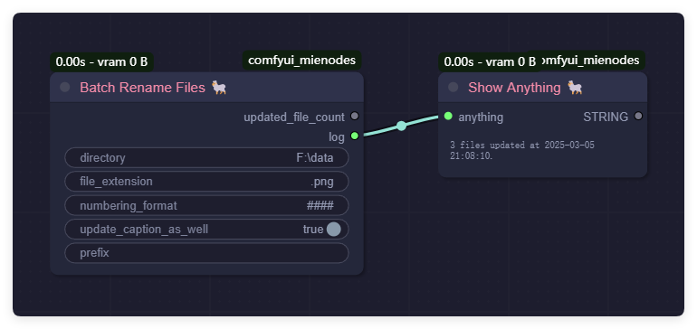

---

### **BatchDeleteFiles**  
**Function:** Batch delete files with the specified extension and optional prefix.  
**Parameters:**  
- `directory` (str): Path to the directory.  
- `file_extension` (str): File extension to delete (e.g., `.jpg`, `.txt`).  
- `prefix` (str, optional): Prefix to check before deleting files.  

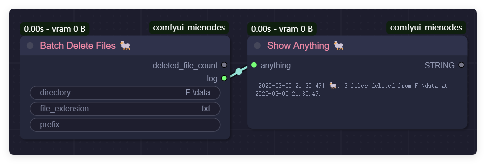

Before:
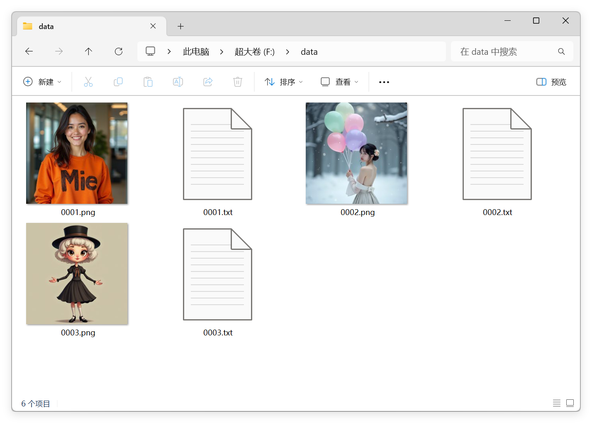

After:
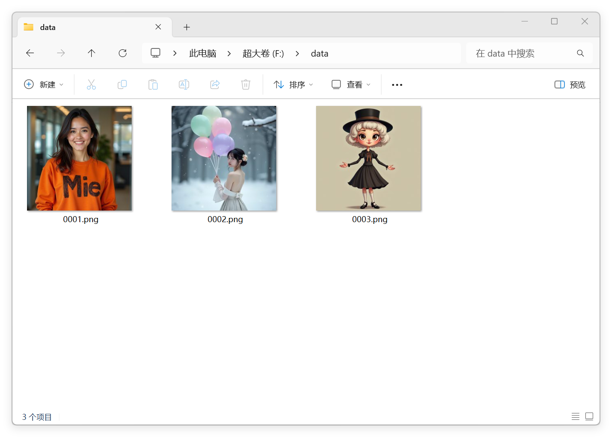

---

### **BatchEditTextFiles**  
**Function:** Perform operations on text files (Insert, Append, Replace, or Remove).  
**Parameters:**  
- `directory` (str): Path to the directory.  
- `operation` (str): Type of operation (`insert`, `append`, `replace`, `remove`).  
- `file_extension` (str, optional): File extension to operate on (e.g., `.txt`).  
- `target_text` (str, optional): Text to replace or remove (only used for Replace or Remove operations).  
- `new_text` (str, optional): New content to insert, append, or replace.  

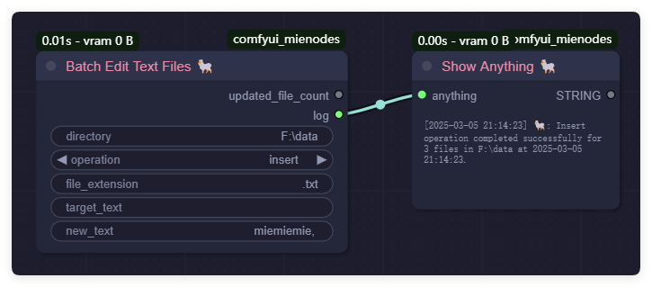

Before:
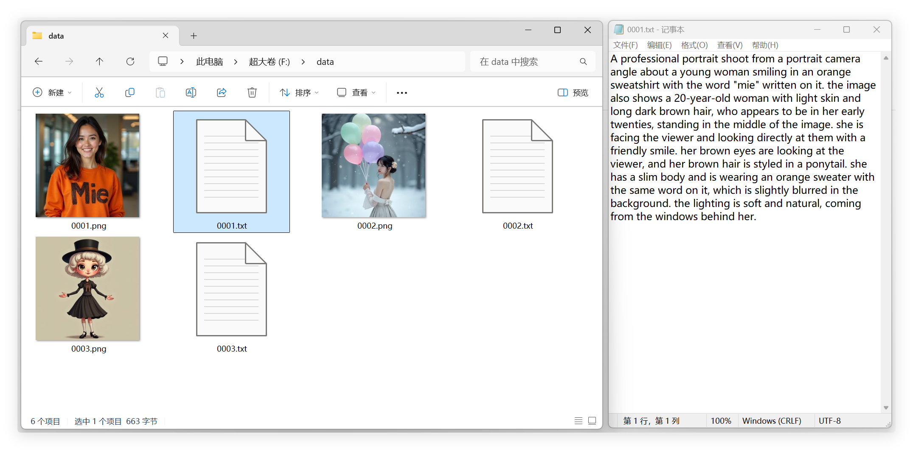

After:
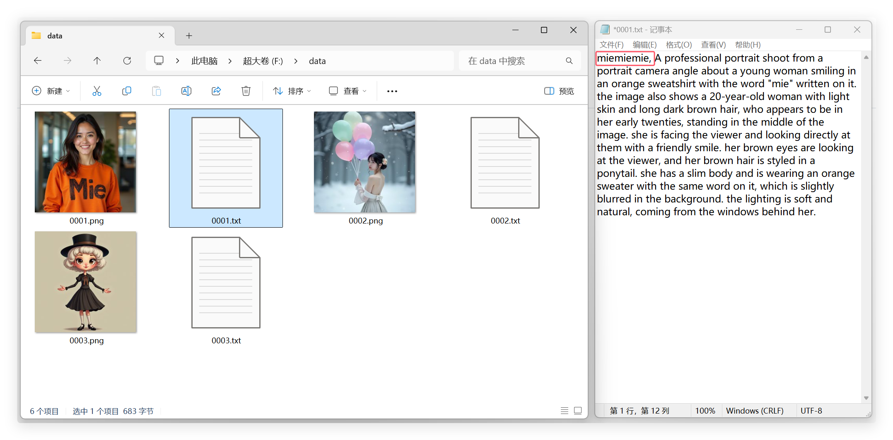

---

### **BatchSyncImageCaptionFiles**  
**Function:** Add caption files (`.txt` files with the same name) for image files in a directory.  
**Parameters:**  
- `directory` (str): Path to the directory.  
- `caption_content` (str): Content to populate in the caption file (e.g., `"nazha,"`).  

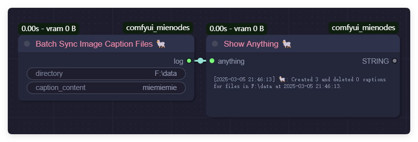

Before:
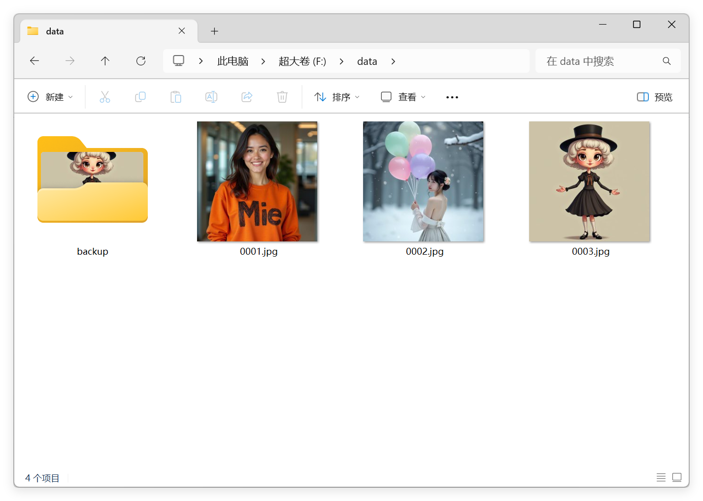

After:
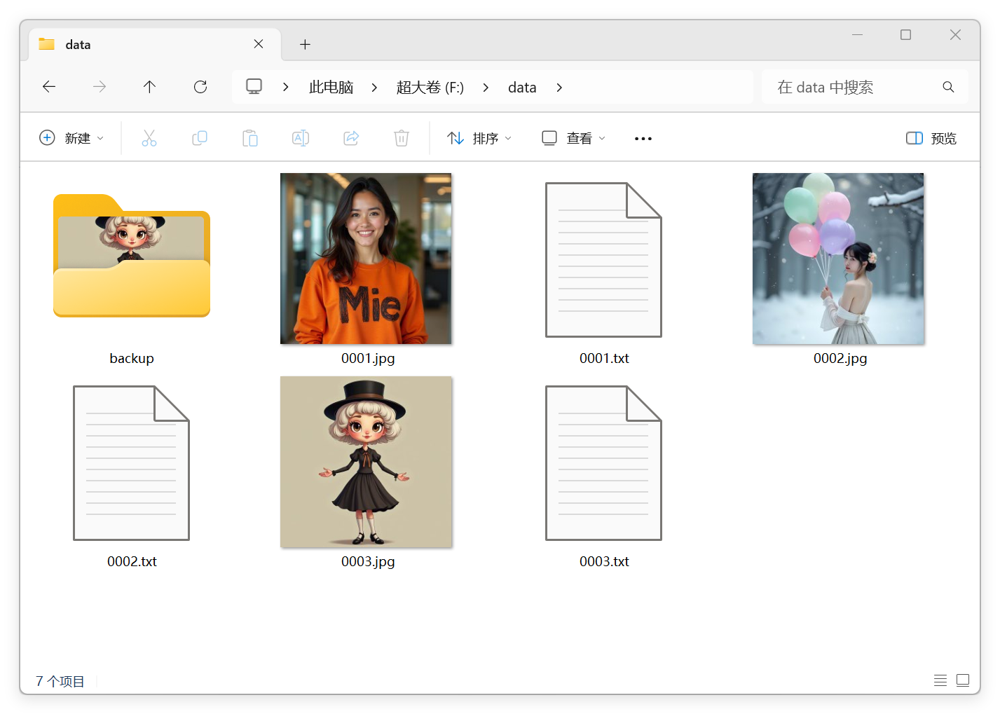

---

### **SummaryTextFiles**  
**Function:** Summarize the content of all text files in a directory.  
**Parameters:**  
- `directory` (str): Path to the directory.  
- `add_separator` (bool): Whether to add a separator between file contents.  
- `save_to_file` (bool): Whether to save the summarized content to a file.  
- `file_extension` (str, optional): File extension to operate on (e.g., `.txt`).  
- `summary_file_name` (str, optional): Name of the file to save the summary.  

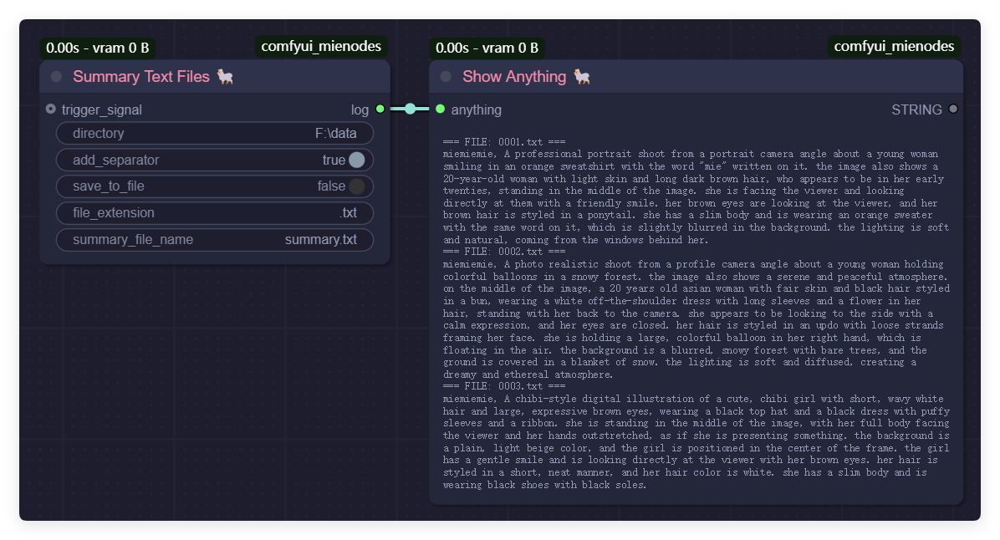

---

### **BatchConvertImageFiles**  
**Function:** Convert all images in a specified directory to the target format.  
**Parameters:**  
- `directory` (str): Path to the directory.  
- `target_format` (str): Target image format (`jpg` or `png`).  
- `save_original` (bool): Whether to retain the original files after conversion.  

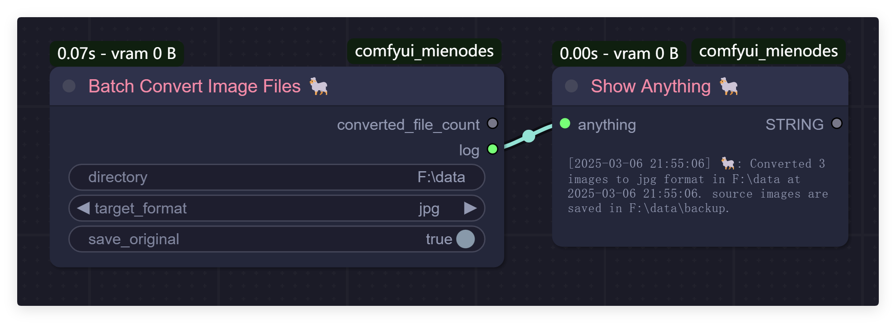

Before:

After:
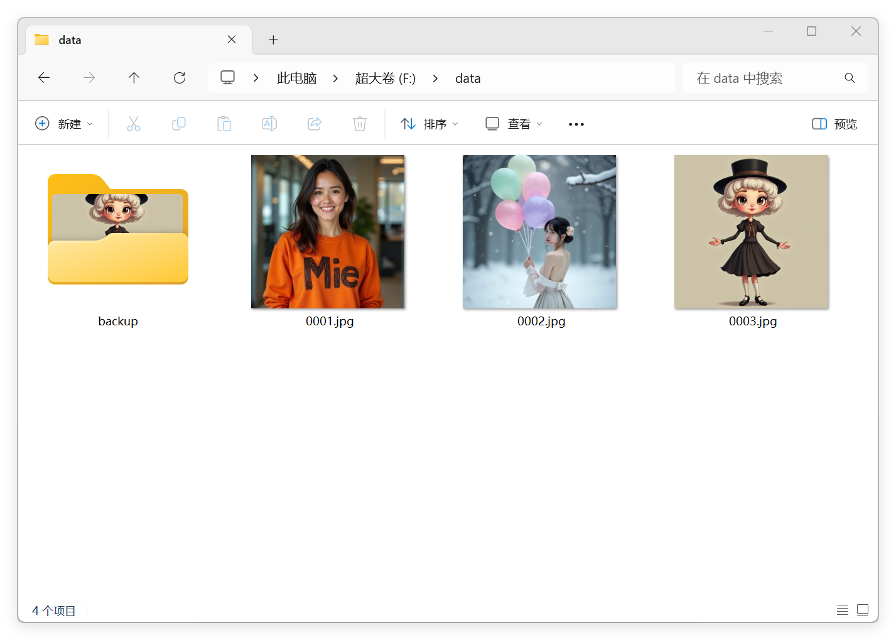

---

### **DedupImageFiles**  
**Function:** Remove duplicate image files in a specific directory.  
**Parameters:**  
- `directory` (str): Path to the directory.  
- `max_distance_threshold` (int): Maximum Hamming distance threshold for identifying duplicates.  

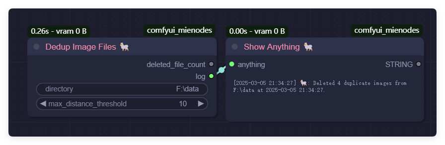

Before:
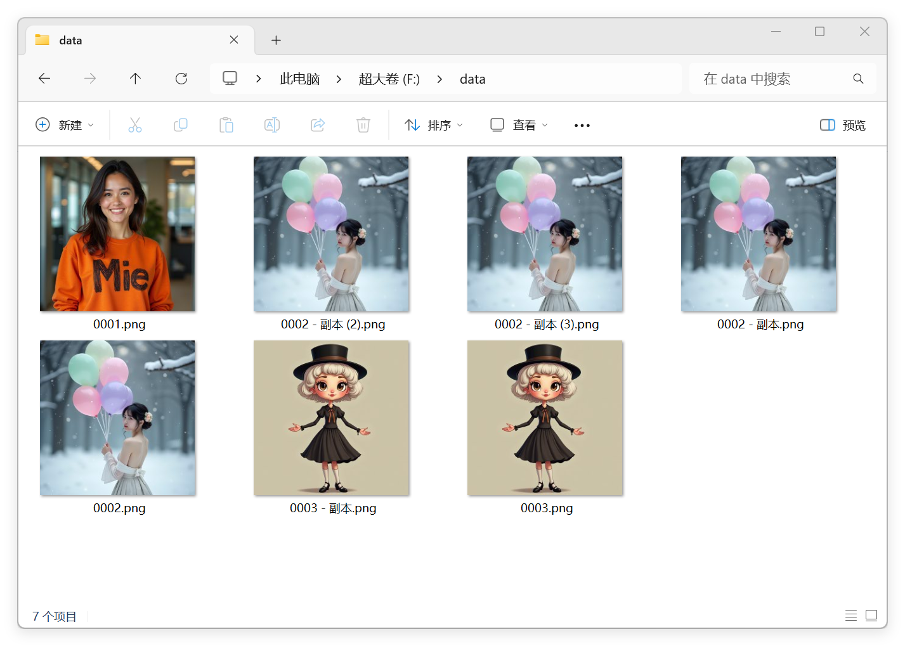

After:

---

### **ShowAnythingMie**  
**Function:** Print the input content as a string.  
**Parameters:**  
- `anything` (*): The input content to display.  

---

### **SaveAnythingAsFile**
**Function:** Save data to a file in either TOML, JSON, or TXT format.  
**Parameters:**  
- `data` (\*): The data to save.  
- `directory` (str): The directory to save the file in.  
- `file_name` (str): The name of the output file.  
- `save_format` (str): The format to save the data in ("json", "toml", or "txt").

---

### **CompareFiles**
**Function:** Compare two files and return the differences.
**Parameter:**
- `file1_path` (str): The path to the first file.
- `file2_path` (str): The path to the second file.
- `file_format` (str): The format of the files ("json" or "toml").

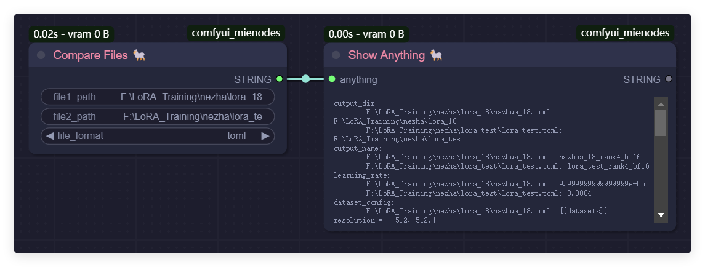

---

### **ModelDownloader**
**Function:** Download files from Hugging Face, hf-mirror, GitHub, or any other source to the models folder.
**Parameters:**
- `url` (str): The URL of the file to download.
- `save_path` (str): The path to save the downloaded file.
- `override` (bool): Whether to override the existing file if it already exists.
- `use_hf_mirror` (bool): Whether to use the Hugging Face mirror URL.
- `rename_to` (str, optional): The new name for the downloaded file (optional).
- `hf_token` (str, optional): The Hugging Face token for authentication (optional).
- `trigger_signal` (\*, optional): A signal to trigger the download (optional).

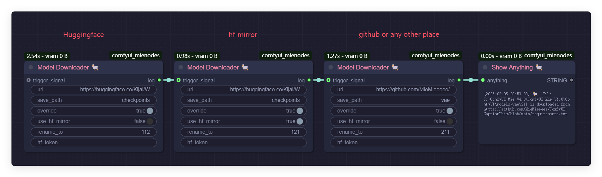

## Future Plans  

ComfyUI-MieNodes is under active development and will expand its features in future updates. Planned additions include:  

- Automatic reverse caption generation for images.  
- Support for complex node chaining to improve data flow integration.  

As the author is a content creator, the plugin will also include many practical tools developed to address specific video production needs. Stay tuned for more updates!  

---

## Contact Me  

- **Bilibili**: [@黎黎原上咩](https://space.bilibili.com/449342345)  
- **YouTube**: [@SweetValberry](https://www.youtube.com/@SweetValberry)  
