# ComfyUI-MieNodes

[English](README.md) | [简体中文](README_CN.md)

**ComfyUI-MieNodes** 是一款为 ComfyUI 生态系统设计的插件，提供了一系列实用节点，旨在简化工作流程并提升效率。

---

## 工作流

当前支持以下服务：
  - [智谱 ZhiPu](https://www.bigmodel.cn/glm-coding?ic=QCHZLYWEXV) — [标准 Open Platform](https://bigmodel.cn/)（`zhipu` 密钥）+ [编程 / Token Plan](https://www.bigmodel.cn/glm-coding)（`zhipu_code` 密钥）双轨
  - [硅基流动 SiliconFlow](https://cloud.siliconflow.cn/i/PYyJkS9S)（`siliconflow` 密钥）
  - [GitHub Models](https://github.com/marketplace?type=models)（`github_models` 密钥，建议用 fine-grained PAT）
  - [Kimi 月之暗面](https://platform.moonshot.cn/)（`kimi` 密钥）
  - [DeepSeek](https://platform.deepseek.com/)（`deepseek` 密钥）
  - [Gemini](https://ai.google.dev/gemini) — 支持多模态（图片按 inline_data 转发）（`gemini` 密钥）
  - [Bailian 阿里云百炼](https://bailian.console.aliyun.com/)（`bailian` 密钥）
  - [MiniMax](https://api.minimaxi.com/) — 标准 Open Platform（`sk-...` 密钥，`minimax_open_platform`）+ [Token Plan / Coding Plan](https://api.minimaxi.com/)（`sk-cp-...` 密钥，`minimax`）双轨
  - [小米 MiMo](https://mimo.mi.com/) — 标准 Open Platform（`sk-...` 密钥，`mimo`）+ [Token Plan / Coding Plan](https://mimo.mi.com/)（`tp-...` 密钥，`mimo_token_plan`）双轨
  - 任何 OpenAI 兼容端点可通过 `SetGeneralLLMServiceConnector` 接入（自定义 base URL + 模型，`openai_compatible` 密钥）

如果你希望使用其他无法通过 SetGeneralLLMServiceConnector 连接的大语言模型（LLM）服务，请提交 issue 或 pull request 进行反馈。

部分服务商（以智谱、硅基流动为主）会提供免费额度模型。免费名单变动较快，请查看服务商官网获取当前免费的模型，然后把模型 id 填入连接器的 `custom_model` 字段。

### 调用 LLM Service 工作流
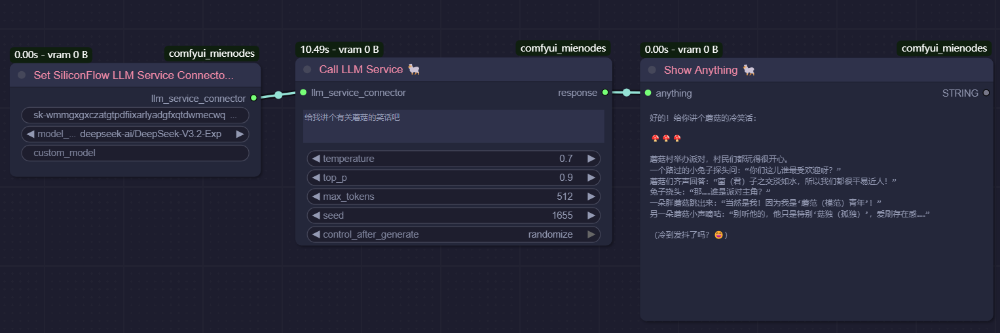

该工作流展示了如何连接到 LLM 服务并基于给定的提示词生成响应，你可以使用任何支持的 LLM 服务。

### Kontext 预设提示词生成工作流

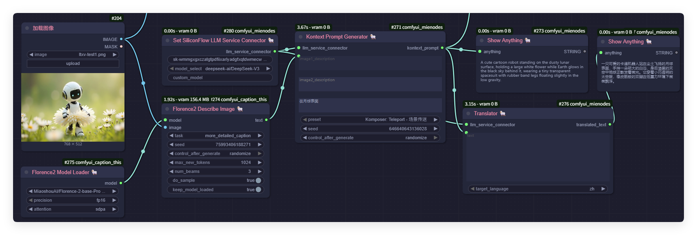

该工作流演示了如何加载图片，利用 Florence2 模型生成详细描述，并借助大语言模型自动生成上下文提示词。最终结果通过 `Show Anything` 节点以中英文展示。  
- **图片加载节点**：加载输入图片。
- **Florence2 模型加载与描述节点**：为图片生成详细注释。
- **Set SiliconFlow LLM 服务连接器 & Kontext Prompt Generator**：利用大语言模型生成上下文相关的提示词。
- **Show Anything**：以多语言输出生成结果。

### 检查 LLM 服务连接工作流
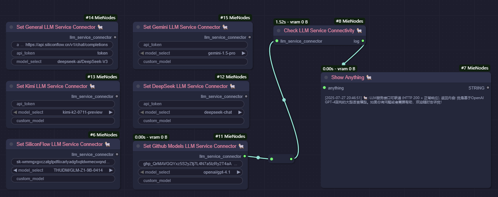

该工作流用于检查 LLM 服务连接状态，并显示结果。

### Kontext 预设添加与移除工作流

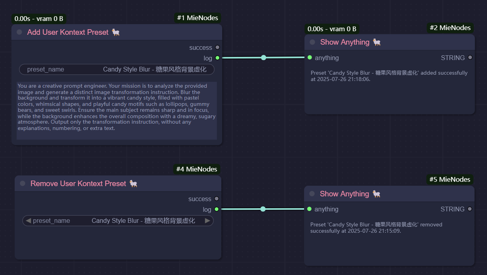

该工作流演示了如何添加和移除自定义预设。

### 高级提示词生成工作流

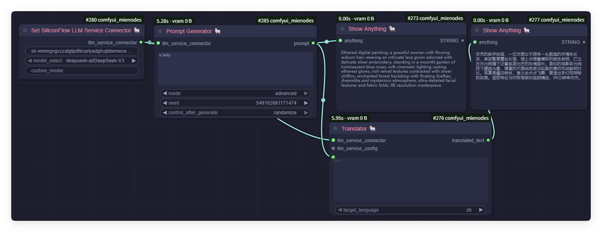

该工作流主要用于生成富有表现力的提示词，结合 LLM 连接器和高级提示词生成节点实现。  
- **Prompt Generator 提示词生成器**：基于简单的输入（支持非英文），生成细节丰富的创意提示词。
- **Show Anything**：中英文展示生成的描述，实现多语言提示词工程集成。

---

### Bernini 提示词生成器工作流

该工作流把用户输入的提示词送入 [Bernini](https://bernini-ai.github.io/) 任务感知提示词增强器（bytedance/Bernini，Apache 2.0），把改写后的任务化提示词写回工作流。下拉框中支持的 13 种任务类型：

- **t2i / t2v** — 文生图 / 文生视频
- **i2i / i2v** — 图生图（图像编辑）/ 图生视频
- **r2i / r2v** — 主体驱动生图 / 主体驱动生视频（需要主体参考图）
- **ri2i** — 参考图引导图像编辑（源图 + 参考图；MieNodes 扩展任务）
- **v2v / mv2v** — 视频编辑 / 多源视频编辑
- **vi2v** — 视频+参考图编辑
- **rv2v / vrc2v** — 参考图引导视频编辑
- **ads2v** — 视频植入视频

参考图与源视频帧会作为 `image_url` 内容部分转发给大模型，让模型看到它要改写的内容。下拉标签采用双语（code + 中文），中文/英文环境都看得懂。

---
## 当前功能

### 提示词增强功能

本插件提供了一系列用于提示词增强的节点，包括：

1. Kontext预设工作流，结合大语言模型，可根据图片和文本输入自动生成高质量的Kontext提示词，支持添加和移除自己的预设。
2. 高级提示词优化，支持自动翻译与细节丰富，输出更具表现力和创意的内容，适用于各类创作任务。

---

### LoRA 训练标注准备功能

该插件提供以下实用节点，专注于 LoRA 训练流程中的数据集文件管理任务：

1. 批量编辑标注文件（插入/追加/替换操作）。
2. 批量重命名文件，添加前缀并格式化文件编号。
3. 同步图像文件和标注文件，支持自动创建或删除与图像对应的 `.txt` 文件。
4. 批量读取标注文件，支持提取所有文件内容，用于大语言模型的分析或总结。
5. 批量转换图像文件，支持将所有图像文件转换为指定格式（`.jpg` 或 `.png`）。
6. 批量删除具有特定扩展名和可选前缀的文件。
7. 删除目标目录中重复（内容相同）的图像文件。
8. 将任意数据保存为 TOML、JSON 或 TXT 格式的文件。
9. 比较两个文件（TOML或JSON格式）并返回差异。

---

### 通用功能

插件还提供了一些常用的实用节点：

1. 将任意输入内容以字符串形式显示。
2. 从 huggingface、hf-mirror，github 或者任意地址下载文件到 models 目录。

---

## 节点功能

### **BatchRenameFiles**
**功能说明：** 批量重命名文件，添加前缀和编号。 
**参数说明：**
- `directory` (str): 目录路径。
- `file_extension` (str): 要操作的文件扩展名，例如 `.jpg`、`.txt`。
- `numbering_format` (str): 编号格式，例如 `###` 表示三位数字。
- `update_caption_as_well` (bool): 是否同时重命名具有相同名称的 `.txt` 文件。
- `prefix` (str, optional): 文件名前缀（可选）。

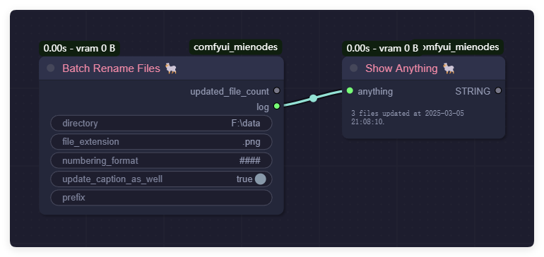

---

### **BatchDeleteFiles**
**功能说明：** 批量删除符合指定扩展名和前缀的文件。 
**参数说明：**
- `directory` (str): 目录路径。
- `file_extension` (str): 要删除的文件扩展名，例如 `.jpg`、`.txt`。
- `prefix` (str, optional): 文件名前缀过滤条件（可选）。

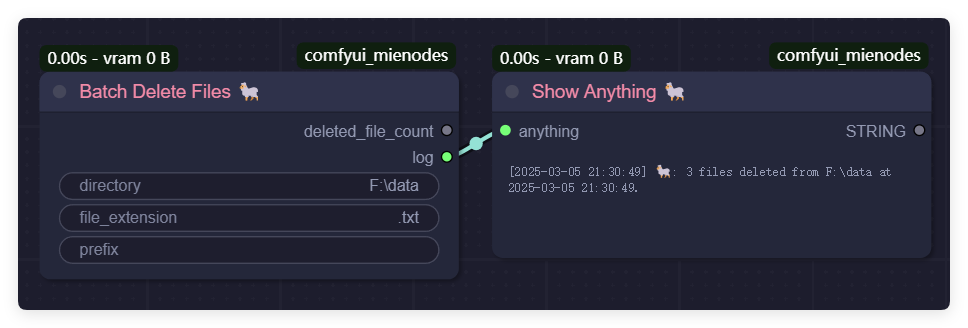

之前：
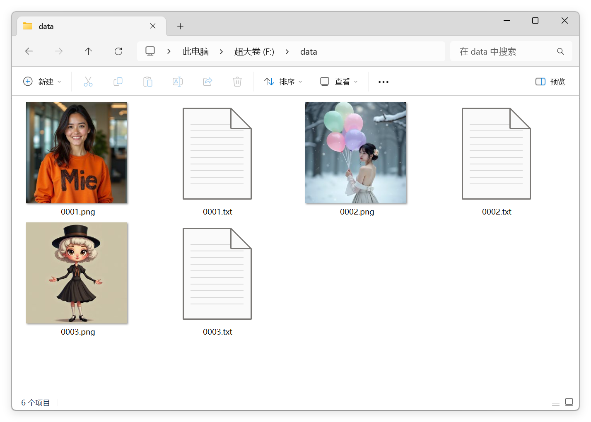

之后：
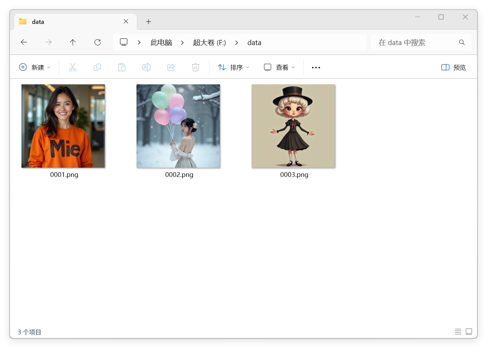

---

### **BatchEditTextFiles**
**功能说明：** 对文本文件执行操作（插入、追加、替换或删除）。 
**参数说明：**
- `directory` (str): 目录路径。
- `operation` (str): 操作类型（`insert`、`append`、`replace`、`remove`）。
- `file_extension` (str, optional): 要操作的文件扩展名，例如 `.txt`。
- `target_text` (str, optional): 替换或删除的目标文本（仅用于替换或删除操作）。
- `new_text` (str, optional): 要插入、追加或替换的新内容。

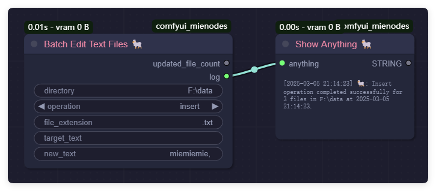

之前：
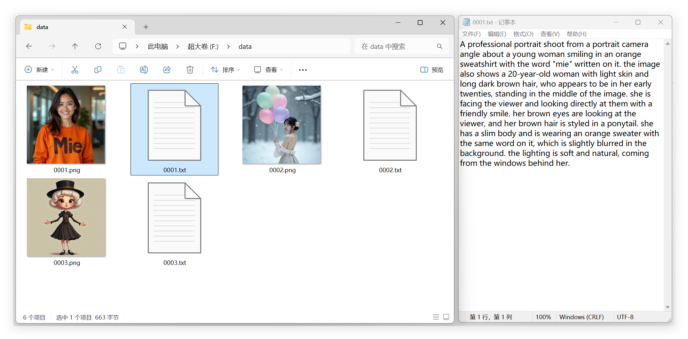

之后：
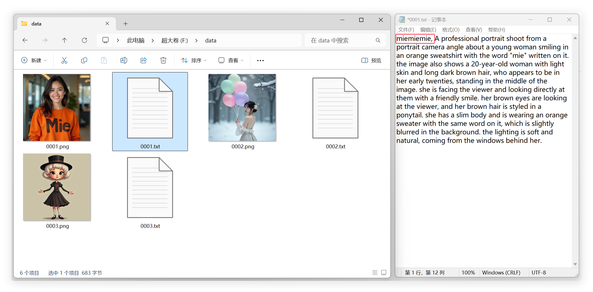

---

### **BatchSyncImageCaptionFiles**
**功能说明：** 为目录中的图像文件添加标注文件（同名 `.txt` 文件）。 
**参数说明：**
- `directory` (str): 目录路径。
- `caption_content` (str): 写入标注文件的内容，例如 `"nazha,"`。

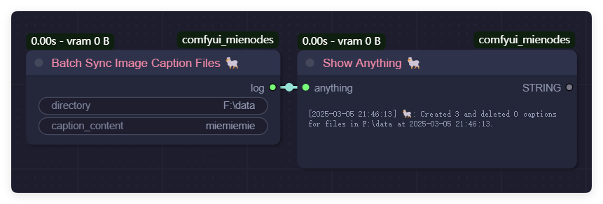

之前：
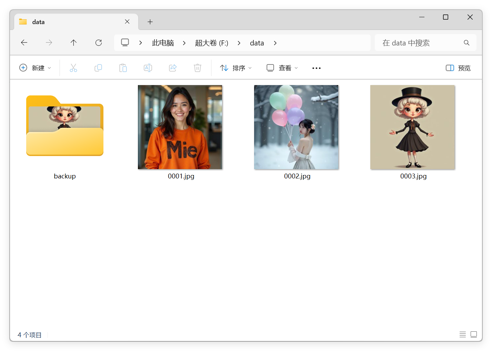

之后：
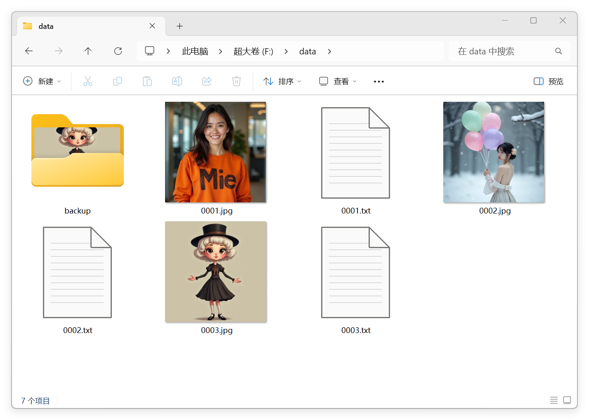

---

### **SummaryTextFiles**
**功能说明：** 摘要生成当前目录下所有文本文件的数据内容。 
**参数说明：**
- `directory` (str): 目录路径。
- `add_separator` (bool): 是否在文件内容之间添加分隔符。
- `save_to_file` (bool): 是否将摘要保存到文件中。
- `file_extension` (str, optional): 要操作的文件扩展名，例如 `.txt`。
- `summary_file_name` (str, optional): 保存摘要的文件名（可选）。

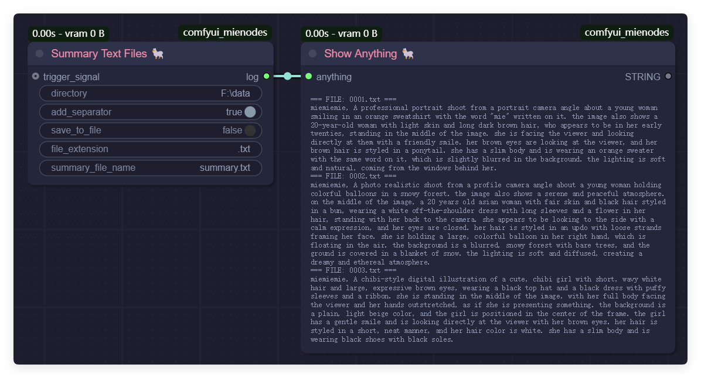

---

### **BatchConvertImageFiles**
**功能说明：** 将指定目录中的所有图像文件转换为目标格式。 
**参数说明：**
- `directory` (str): 目录路径。
- `target_format` (str): 目标图像格式（`jpg` 或 `png`）。
- `save_original` (bool): 是否保留原始文件。

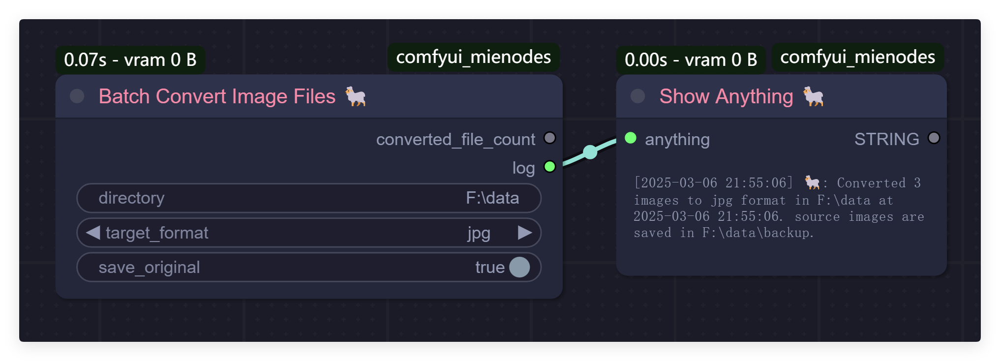

之前：

之后：
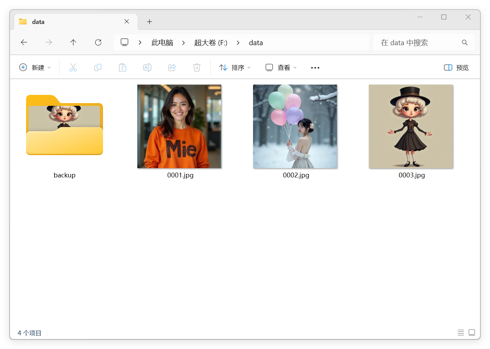

---

### **DedupImageFiles**
**功能说明：** 删除指定目录中的重复图像文件。 
**参数说明：**
- `directory` (str): 目录路径。
- `max_distance_threshold` (int): 最大 Hamming 距离阈值，用于判断图像是否重复。

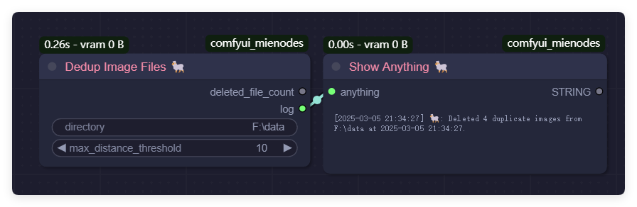

之前：
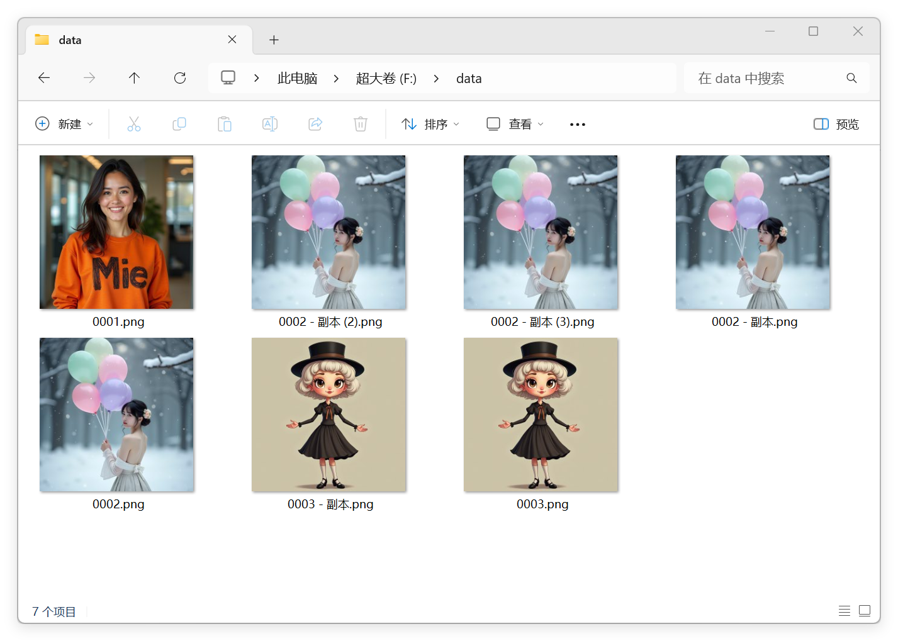

之后：

---

### **ShowAnythingMie**
**功能说明：** 将输入内容以字符串形式打印输出。 
**参数说明：**
- `anything` (*): 输入的任意内容。

---

### **SaveAnythingAsFile**
**功能说明：** 将数据保存为 TOML、JSON 或 TXT 格式的文件。 
**参数说明：**
- `data` (\*): 要保存的数据。
- `directory` (str): 保存文件的目录。
- `file_name` (str): 输出文件的名称。
- `save_format` (str): 保存数据的格式（"json"、"toml" 或 "txt"）。

---

### **CompareFiles**
**功能说明：** 比较两个文件并返回差异。 
**参数说明：**
- `file1_path` (str): 第一个文件的路径。
- `file2_path` (str): 第二个文件的路径。
- `file_format` (str): 文件的格式（"json" 或 "toml"）。

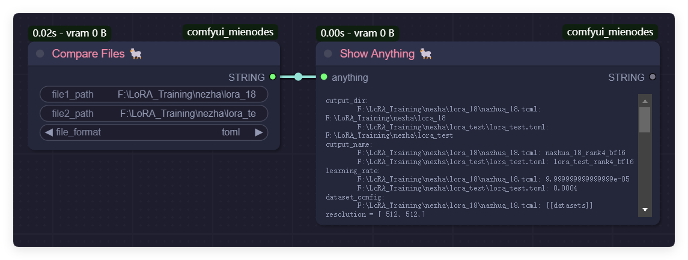
---

### **StringFormat**（字符串格式化）
**功能说明：** 按 Python `str.format` 风格把模板和多个值拼成字符串，输入槽位数量可自动增长（仿 Bernini Conditioning 节点的体验）。
**参数说明：**
- `template` (str)：格式模板，支持 `{0}`、`{1}` 等位置占位符和标准格式说明符（如 `{0:>5}`、`{0:.2f}`），需要输出字面量 `{` 或 `}` 时分别写作 `{{` / `}}`。
- `value_0` ... `value_15` (str, optional)：按位置传入的值，每个槽位一个。节点拖出时默认显示前 2 个槽位（`value_0`、`value_1`），每当最后一个可见槽位被接入连线，JS 扩展会自动追加下一个槽位，最多到 16 个。未连接的槽位按空字符串处理。
**输出说明：**
- `result` (str)：格式化后的字符串。模板语法错误时会记录诊断日志并原样返回模板，便于在工作流中直接看到。
**示例：** 模板 `"{0} + {1} = {2}"` 配合 `value_0="1"`、`value_1="2"`、`value_2="3"`，输出 `"1 + 2 = 3"`。

---

### **ModelDownloader**
**功能说明：** 从 Hugging Face、hf-mirror、GitHub 或其他来源下载文件到 models 目录。 
**参数说明：**
- `url` (str): 要下载的文件的 URL。
- `save_path` (str): 保存下载文件的路径。
- `override` (bool): 是否覆盖已存在的文件。
- `use_hf_mirror` (bool): 是否使用 Hugging Face 镜像 URL。
- `rename_to` (str, optional): 下载文件的新名称（可选）。
- `hf_token` (str, optional): Hugging Face 认证令牌（可选）。
- `trigger_signal` (\*, optional): 触发下载的信号（可选）。

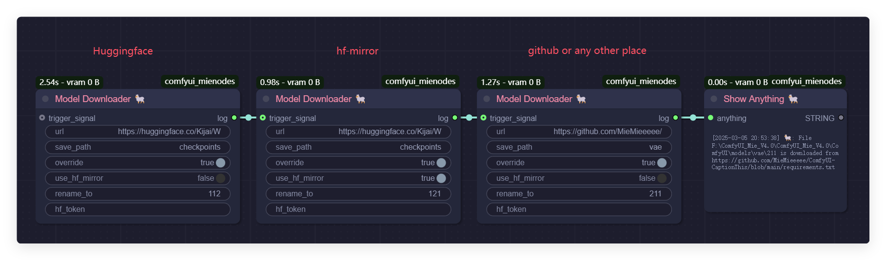

---

### LLM 配置文件（`mie_llm_keys.json`）

每个 `Set*LLMServiceConnector` 节点都可以从本地 JSON 文件里拿密钥，而不必手工填到节点的 `api_token` 输入框里。把 [mie_llm_keys.json.example](mie_llm_keys.json.example) 复制成 `mie_llm_keys.json` 放到本 README 同目录，只填你要用的服务，不用的留空即可。该文件由 `core.utils.load_plugin_config` 读取，项目里 **不会** 提交，所以每个安装 / clone 都能各自保留自己的密钥。

每个连接器的 `config_key` 默认值与示例文件里的 JSON 键名一致。默认不动就读对应的条目；也可以在节点上改成其它键名，从同一个文件里读另一个条目。

| `config_key`（默认） | 连接器 | 服务商 / 资质 | 密钥格式示例 |
| --- | --- | --- | --- |
| `openai_compatible` | `SetGeneralLLMServiceConnector` | 任意 OpenAI 兼容端点（自定义 base URL） | 随服务商 |
| `github_models` | `SetGithubModelsLLMServiceConnector` | [GitHub Models](https://github.com/marketplace?type=models) | `ghp_...`（建议 fine-grained PAT） |
| `siliconflow` | `SetSiliconFlowLLMServiceConnector` | [硅基流动 SiliconFlow](https://cloud.siliconflow.cn/i/PYyJkS9S) | `sk-...` |
| `zhipu` | `SetZhiPuLLMServiceConnector` | [智谱 ZhiPu Open Platform](https://bigmodel.cn/) | `... .xxx` |
| `zhipu_code` | `SetZhiPuCodeLLMServiceConnector` | [智谱 ZhiPu Coding / Token Plan](https://www.bigmodel.cn/glm-coding) | `... .xxx` |
| `kimi` | `SetKimiLLMServiceConnector` | [Kimi 月之暗面](https://platform.moonshot.cn/) | `sk-...` |
| `deepseek` | `SetDeepSeekLLMServiceConnector` | [DeepSeek](https://platform.deepseek.com/) | `sk-...` |
| `minimax_open_platform` | `SetMiniMaxLLMServiceConnector` | [MiniMax Open Platform](https://api.minimaxi.com/) | `eyJ...`（JWT） |
| `minimax` | `SetMiniMaxTokenPlanLLMServiceConnector` | MiniMax Token Plan / Coding Plan | `sk-cp-...` |
| `mimo` | `SetMiMoLLMServiceConnector` | [小米 MiMo Open Platform](https://mimo.mi.com/) | `sk-...` |
| `mimo_token_plan` | `SetMiMoTokenPlanLLMServiceConnector` | 小米 MiMo Token Plan / Coding Plan | `tp-...` |
| `gemini` | `SetGeminiLLMServiceConnector` | [Google Gemini](https://ai.google.dev/gemini) | `AIza...` |
| `bailian` | `SetBailianLLMServiceConnector` | [Bailian 阿里云百炼](https://bailian.console.aliyun.com/) | `sk-...` |

**解析规则**（与 `core.utils.resolve_token` 一致）：

1. 连接器从 `config_file` 指定的路径读取 JSON（默认：插件根目录下的 `mie_llm_keys.json`，与本 README 同目录）。
2. 按 `config_key` 查找对应条目（默认值见上表），也可以在节点上改成其它键名。
3. `prefer_local_config=True`（默认）时，JSON 文件里的值优先；只有当文件不存在或条目为空时才会用节点 `api_token` 输入框里的值。切到 `False` 则让节点输入框优先——适合在文件里保留个占位符，但按工作流个别覆盖密钥的场景。

想用另一个配置文件（比如团队公用、存在插件外部的那种），把节点上的 `config_file` 改成它的绝对路径即可。

### **SetMiniMaxLLMServiceConnector**（标准版，非 token plan）
**功能：** 用标准 `eyJ...`（JWT）密钥接入 MiniMax Open Platform。
**参数：**
- `api_token`（str）：API 密钥，留空时使用 `mie_llm_keys.json` 里的 `minimax_open_platform` 条目。
- `model_select`：`MiniMax-M2.7`（默认）/ `MiniMax-M2.7-highspeed` / `MiniMax-M2.5` / `MiniMax-M2.5-highspeed` / `Custom`。
- `config_file` / `config_key` / `prefer_local_config`：标准配置项。

### **SetMiniMaxTokenPlanLLMServiceConnector**（Token Plan）
**功能：** 用 `sk-cp-...` 密钥接入 MiniMax Token Plan / 编程包端点。
**参数：**
- `api_token`（str）：Token Plan 密钥，留空时使用 `mie_llm_keys.json` 里的 `minimax` 条目。
- `model_select`：`MiniMax-M3`（默认）/ `MiniMax-M2.7` / `MiniMax-M2.7-highspeed` / `MiniMax-M2.5` / `MiniMax-M2.5-highspeed` / `Custom`。
- `config_file` / `config_key` / `prefer_local_config`：标准配置项。

MiniMax 连接器在请求前会做一次 image_detail 清洗，把 `detail: "auto"` 从 `image_url` 中去掉——MiniMax API 拒绝该值（HTTP 400）。其他 OpenAI 兼容服务（SiliconFlow、智谱、Kimi 等）不受影响。

### **SetMiMoLLMServiceConnector**（标准版，非 token plan）
**功能：** 用标准 `sk-...` API 密钥接入小米 MiMo Open Platform（`https://api.xiaomimimo.com/v1`）。
**参数：**
- `api_token`（str）：API 密钥，留空时使用 `mie_llm_keys.json` 里的 `mimo` 条目。
- `model_select`：`mimo-v2.5-pro`（默认，Pro / 深度思考，1M 上下文，128K 输出）／`mimo-v2.5`（Omni / 全模态，1M 上下文）／`mimo-v2-omni`（Omni，256K 上下文）／`mimo-v2-flash`（Flash / 低成本，256K 上下文）／`mimo-v2-pro`（Pro，旧版）／`Custom`。
- `config_file` / `config_key` / `prefer_local_config`：标准配置项。

### **SetMiMoTokenPlanLLMServiceConnector**（Token Plan）
**功能：** 用 `tp-...` API 密钥接入 MiMo Token Plan / 编程包端点（`https://token-plan-cn.xiaomimimo.com/v1`）。Token Plan 是固定费用的订阅制，base URL 、计费方式都与标准版独立；可用模型列表与标准版共享。
**参数：**
- `api_token`（str）：Token Plan 密钥，留空时使用 `mie_llm_keys.json` 里的 `mimo_token_plan` 条目。
- `model_select`：同标准版，默认 `mimo-v2.5-pro`。
- `config_file` / `config_key` / `prefer_local_config`：标准配置项。

MiMo 连接器发送的是 OpenAI 兼容端点 `/v1/chat/completions`，但参数使用 `max_completion_tokens`（非旧版 `max_tokens`），并从 payload 中去掉 `top_k` / `n` / `response_format`（MiMo 文档仍未出现这些字段，发送往往会 400）。默认参数：`temperature=1.0`、`top_p=0.95`。image_detail 清洗与 MiniMax 一致：去除 `detail: "auto"`，明确传入的 `low` / `high` 会保留。

### **BerniniPromptGenerator**
**功能：** 用 Bernini 任务感知系统提示词改写用户提示词。可选地把源媒体（1 张源图或一批源视频帧）、0+ 张图像参考以及 0+ 张视频参考帧一起转给 LLM，让模型看到改写对象。
**参数：**
- `llm_service_connector`（`LLMServiceConnector`）：上面任一连接器。
- `task_type`：13 种任务之一（下拉显示 `code - 中文`），默认 `t2i - 文生图`。`ri2i (扩展)` 是 MieNodes 扩展任务。
- `user_prompt`（str）：原始提示词。
- `source`（`IMAGE`，可选）：被操作的对象。图源任务（`i2i` / `ri2i` / `i2v`）传 1 张图；视频源任务（`v2v` / `mv2v` / `vi2v` / `rv2v` / `vrc2v` / `ads2v`）传一批视频帧；`r2i` / `r2v` 不用此参数。
- `reference_images`（`IMAGE`，可选）：0+ 张图像参考。`r2i` / `r2v` 传主体图；`ri2i` / `vi2v` / `rv2v` / `vrc2v` 传引导素材；`i2v` 无 source 时可作为铆点回退。
- `reference_video`（`IMAGE`，可选）：0+ 视频参考帧。`ads2v` 用以插入广告视频；`vrc2v` 用以提供参考视频内容。全部转发，LLM 自己选择相关帧。
- `video_frames`（int，1-16）：当任务把 `source` 当视频帧处理时，采样并转发的帧数（图源任务忽略此参数）。默认 3。
- `image_detail`（`auto` / `low` / `high`）：OpenAI 风格的图片细节参数。
- `temperature` / `top_p` / `max_tokens`：标准采样参数。

路由细节：
- `t2i`、`t2v` 使用专用中文系统提示词（`T2I_A14B_EN_SYS_PROMPT`、`T2V_A14B_EN_SYS_PROMPT`）。
- 其余 11 个任务使用 `bernini_prompts.SYSTEM_PROMPTS` 里的任务系统提示词，并通过对应的 `*_TEMPLATE` 路由参考素材。
- `r2i`、`r2v`、`rv2v`、`vrc2v`、`ri2i` 输出 JSON 模式（`{"rewritten_text": "..."}`），节点解析 JSON 后只返回内层字符串。

---
## 未来计划

ComfyUI-MieNodes 插件正在积极开发中，未来将进一步扩展功能。规划中的新功能包括：

- 自动生成图像的逆向标注（Reverse Caption）。
- 支持复杂的节点链路配置，以提升数据流集成能力。

由于作者同时是一名内容创作者，未来还将根据视频创作需求，陆续添加众多实用工具。敬请期待更多更新！

---

## 联系方式

- **B站**: [@黎黎原上咩](https://space.bilibili.com/449342345)
- **YouTube**: [@SweetValberry](https://www.youtube.com/@SweetValberry)

---

## 致谢

本项目的部分功能借鉴了以下开源项目的工作（部分为直接复刻），在此向原作者与贡献者表示衷心的感谢。

- **[Bernini](https://bernini-ai.github.io/)**（作者：ByteDance Bernini 团队 — 陈辰辰、刘俊逸、李磊、池路、孙明珍、李卓颖、付毅、郭若愚、吴易恒、白鸽、袁泽寰）。
  本项目中 `BerniniPromptGenerator` 节点（实现见 [`nodes/llm/bernini_prompts.py`](nodes/llm/bernini_prompts.py) 与 [`nodes/llm/bernini_prompt_generator.py`](nodes/llm/bernini_prompt_generator.py)）所沿用的 12 套任务感知系统提示词与用户模板是上游 [bytedance/Bernini](https://github.com/bytedance/Bernini) 提示词库（Apache 2.0）的逐字复刻；任务路由逻辑是该仓库 `bernini.prompt_enhancer.PromptEnhancer` 的 ComfyUI 友好移植版本。感谢 Bernini 团队为多模态生成提示词工程公开的资产与实现参考。

- **[rgthree-comfy](https://github.com/rgthree/rgthree-comfy)**（作者：[@rgthree](https://github.com/rgthree)）
  本项目的 SimpleText 与 RichText 画布标注节点（实现见 [js/textNodes.js](js/textNodes.js) 与 [
odes/common/text_nodes.py](nodes/common/text_nodes.py)）是 rgthree Label 节点的直接复刻：透明的 LiteGraph 外壳、LGraphCanvas.prototype.drawNode 的劫持包装、Canvas 
oundRect / draw(ctx) 渲染流程、以及 Python 端 no-op 的 INPUT_TYPES / 
oop 壳层均沿用了 rgthree 的实现思路；RichText 在同一思路之上额外叠加了 DOM widget 以渲染经过清理的 Markdown。感谢 rgthree 提供了清晰、可学习的参考实现，也感谢其长期以来为 ComfyUI 节点生态所做出的贡献。
