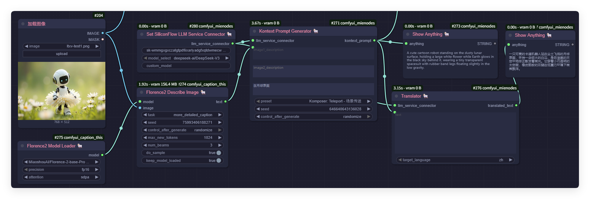
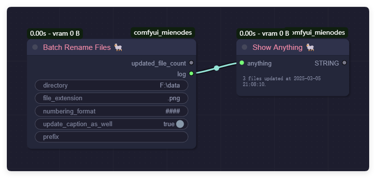
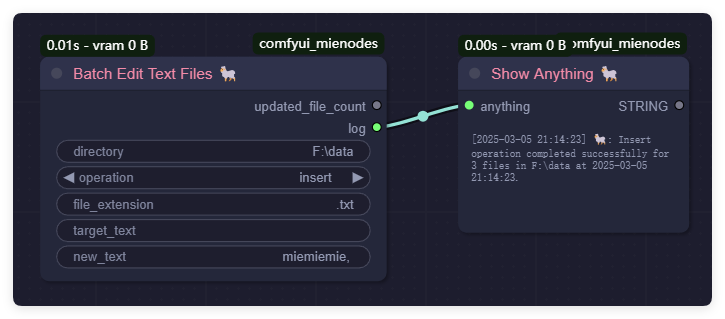
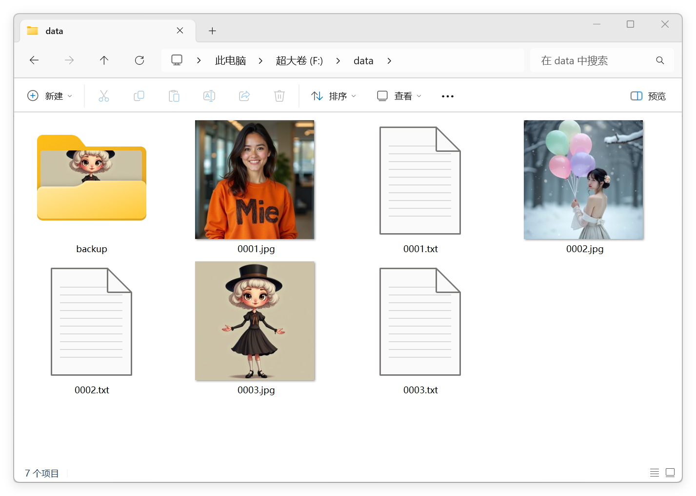
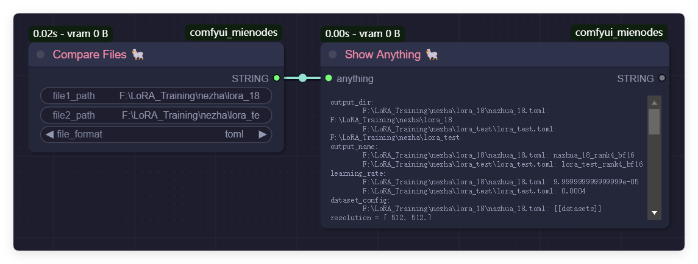

# ComfyUI-MieNodes

[English](README.md) | [简体中文](README_CN.md)

**ComfyUI-MieNodes** 是一款为 ComfyUI 生态系统设计的插件，提供了一系列实用节点，旨在简化工作流程并提升效率。

---

## 工作流

当前支持以下服务：
  - [智谱 ZhiPu](https://www.bigmodel.cn/invite?icode=saVhjJ197Yj7qCQ24NRSpGczbXFgPRGIalpycrEwJ28%3D)
  - [硅基流动 SiliconFlow](https://cloud.siliconflow.cn/i/PYyJkS9S)
  - [GitHub Models](https://github.com/marketplace?type=models)
  - [Kimi](https://platform.moonshot.cn)
  - [DeepSeek](https://platform.deepseek.com)
  - [Gemini](https://ai.google.dev/gemini) - 我觉得它可以工作，但我现在无法测试。

如果你希望使用其他无法通过 SetGeneralLLMServiceConnector 连接的大语言模型（LLM）服务，请提交 issue 或 pull request 进行反馈。

其中智谱AI的 GLM-4-Flash-250414 和 硅基流动的 Qwen3-8B、GLM-Z1-9B-0414、GLN-4-9B-0414 是免费模型，只需要注册获取一个API Key（或Token）即可随意使用。

### Kontext 预设提示词生成工作流

该工作流演示了如何加载图片，利用 Florence2 模型生成详细描述，并借助大语言模型自动生成上下文提示词。最终结果通过 `Show Anything` 节点以中英文展示。  
- **图片加载节点**：加载输入图片。
- **Florence2 模型加载与描述节点**：为图片生成详细注释。
- **Set SiliconFlow LLM 服务连接器 & Kontext Prompt Generator**：利用大语言模型生成上下文相关的提示词。
- **Show Anything**：以多语言输出生成结果。

### 检查 LLM 服务连接工作流

该工作流用于检查 LLM 服务连接状态，并显示结果。

### Kontext 预设添加与移除工作流

该工作流演示了如何添加和移除自定义预设。

### 高级提示词生成工作流

该工作流主要用于生成富有表现力的提示词，结合 LLM 连接器和高级提示词生成节点实现。  
- **Prompt Generator 提示词生成器**：基于简单的输入（支持非英文），生成细节丰富的创意提示词。
- **Show Anything**：中英文展示生成的描述，实现多语言提示词工程集成。

---

## 当前功能

### 提示词增强功能

本插件提供了一系列用于提示词增强的节点，包括：

1. Kontext预设工作流，结合大语言模型，可根据图片和文本输入自动生成高质量的Kontext提示词，支持添加和移除自己的预设。
2. 高级提示词优化，支持自动翻译与细节丰富，输出更具表现力和创意的内容，适用于各类创作任务。

---

### LoRA 训练标注准备功能

该插件提供以下实用节点，专注于 LoRA 训练流程中的数据集文件管理任务：

1. 批量编辑标注文件（插入/追加/替换操作）。
2. 批量重命名文件，添加前缀并格式化文件编号。
3. 同步图像文件和标注文件，支持自动创建或删除与图像对应的 `.txt` 文件。
4. 批量读取标注文件，支持提取所有文件内容，用于大语言模型的分析或总结。
5. 批量转换图像文件，支持将所有图像文件转换为指定格式（`.jpg` 或 `.png`）。
6. 批量删除具有特定扩展名和可选前缀的文件。
7. 删除目标目录中重复（内容相同）的图像文件。
8. 将任意数据保存为 TOML、JSON 或 TXT 格式的文件。
9. 比较两个文件（TOML或JSON格式）并返回差异。

---

### 通用功能

插件还提供了一些常用的实用节点：

1. 将任意输入内容以字符串形式显示。
2. 从 huggingface、hf-mirror，github 或者任意地址下载文件到 models 目录。

---

## 节点功能

### **BatchRenameFiles**
**功能说明：** 批量重命名文件，添加前缀和编号。 
**参数说明：**
- `directory` (str): 目录路径。
- `file_extension` (str): 要操作的文件扩展名，例如 `.jpg`、`.txt`。
- `numbering_format` (str): 编号格式，例如 `###` 表示三位数字。
- `update_caption_as_well` (bool): 是否同时重命名具有相同名称的 `.txt` 文件。
- `prefix` (str, optional): 文件名前缀（可选）。

---

### **BatchDeleteFiles**
**功能说明：** 批量删除符合指定扩展名和前缀的文件。 
**参数说明：**
- `directory` (str): 目录路径。
- `file_extension` (str): 要删除的文件扩展名，例如 `.jpg`、`.txt`。
- `prefix` (str, optional): 文件名前缀过滤条件（可选）。

之前：

之后：

---

### **BatchEditTextFiles**
**功能说明：** 对文本文件执行操作（插入、追加、替换或删除）。 
**参数说明：**
- `directory` (str): 目录路径。
- `operation` (str): 操作类型（`insert`、`append`、`replace`、`remove`）。
- `file_extension` (str, optional): 要操作的文件扩展名，例如 `.txt`。
- `target_text` (str, optional): 替换或删除的目标文本（仅用于替换或删除操作）。
- `new_text` (str, optional): 要插入、追加或替换的新内容。

之前：

之后：

---

### **BatchSyncImageCaptionFiles**
**功能说明：** 为目录中的图像文件添加标注文件（同名 `.txt` 文件）。 
**参数说明：**
- `directory` (str): 目录路径。
- `caption_content` (str): 写入标注文件的内容，例如 `"nazha,"`。

之前：

之后：

---

### **SummaryTextFiles**
**功能说明：** 摘要生成当前目录下所有文本文件的数据内容。 
**参数说明：**
- `directory` (str): 目录路径。
- `add_separator` (bool): 是否在文件内容之间添加分隔符。
- `save_to_file` (bool): 是否将摘要保存到文件中。
- `file_extension` (str, optional): 要操作的文件扩展名，例如 `.txt`。
- `summary_file_name` (str, optional): 保存摘要的文件名（可选）。

---

### **BatchConvertImageFiles**
**功能说明：** 将指定目录中的所有图像文件转换为目标格式。 
**参数说明：**
- `directory` (str): 目录路径。
- `target_format` (str): 目标图像格式（`jpg` 或 `png`）。
- `save_original` (bool): 是否保留原始文件。

之前：

之后：

---

### **DedupImageFiles**
**功能说明：** 删除指定目录中的重复图像文件。 
**参数说明：**
- `directory` (str): 目录路径。
- `max_distance_threshold` (int): 最大 Hamming 距离阈值，用于判断图像是否重复。

之前：

之后：

---

### **ShowAnythingMie**
**功能说明：** 将输入内容以字符串形式打印输出。 
**参数说明：**
- `anything` (*): 输入的任意内容。

---

### **SaveAnythingAsFile**
**功能说明：** 将数据保存为 TOML、JSON 或 TXT 格式的文件。 
**参数说明：**
- `data` (\*): 要保存的数据。
- `directory` (str): 保存文件的目录。
- `file_name` (str): 输出文件的名称。
- `save_format` (str): 保存数据的格式（"json"、"toml" 或 "txt"）。

---

### **CompareFiles**
**功能说明：** 比较两个文件并返回差异。 
**参数说明：**
- `file1_path` (str): 第一个文件的路径。
- `file2_path` (str): 第二个文件的路径。
- `file_format` (str): 文件的格式（"json" 或 "toml"）。

---

### **ModelDownloader**
**功能说明：** 从 Hugging Face、hf-mirror、GitHub 或其他来源下载文件到 models 目录。 
**参数说明：**
- `url` (str): 要下载的文件的 URL。
- `save_path` (str): 保存下载文件的路径。
- `override` (bool): 是否覆盖已存在的文件。
- `use_hf_mirror` (bool): 是否使用 Hugging Face 镜像 URL。
- `rename_to` (str, optional): 下载文件的新名称（可选）。
- `hf_token` (str, optional): Hugging Face 认证令牌（可选）。
- `trigger_signal` (\*, optional): 触发下载的信号（可选）。

---

## 未来计划

ComfyUI-MieNodes 插件正在积极开发中，未来将进一步扩展功能。规划中的新功能包括：

- 自动生成图像的逆向标注（Reverse Caption）。
- 支持复杂的节点链路配置，以提升数据流集成能力。

由于作者同时是一名内容创作者，未来还将根据视频创作需求，陆续添加众多实用工具。敬请期待更多更新！

---

## 联系方式

- **B站**: [@黎黎原上咩](https://space.bilibili.com/449342345)
- **YouTube**: [@SweetValberry](https://www.youtube.com/@SweetValberry)
